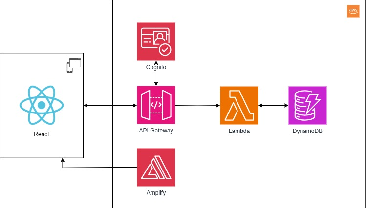

# Architecture

## Composants
- [API Gateway](https://docs.aws.amazon.com/apigateway/) : interface fournissant une API pour tout le backend
- [Lambda](https://docs.aws.amazon.com/lambda/) : Backend, tourne sur Python 3.13
- [DynamoDB](https://docs.aws.amazon.com/dynamodb/) : Base de données NoSQL
- [AWS Amplify](https://docs.aws.amazon.com/amplify/) : build et sert le frontend de manière statique, à partir de Github
- [React](https://react.dev/) : Framework frontend (Javascript) utilisé pour le frontend
- [AWS Cognito](https://docs.aws.amazon.com/cognito/) : authentification et autorisation des utilisateurs
- Material UI : Librairie de composants pour l'interface utilisateur

## Diagramme

## Frontend
Le frontend est construit avec React sur Vite.js. L'application web résultante fonctionne sur n'importe quel navigateur, mobile ou desktop.

Le frontend est servi depuis AWS Amplify qui fait tourner Vite.

## Backend
Le backend est composé de plusieurs services AWS, API Gateway pour recevoir les requêtes et préparer les réponses, Lambda pour le compute et DynamoDB pour le stockage.

Le backend est organisés en trois services :

- **Product** : ce service fournit les interfaces pour gérer les différentes matières premières et produits finis disponibles
- **Inventory** : permet de gérer les lots, ainsi que de faire toutes les manipulations de stock: réception et sortie.
- **Production** : permet de gérer les événements de production. Ce service fait appel au service `Inventory` pour modifier les stocks.